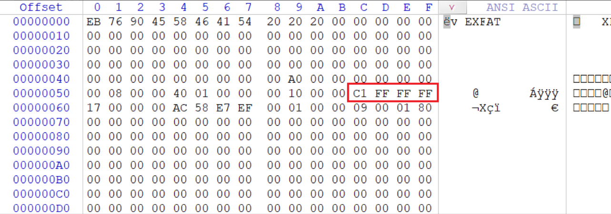
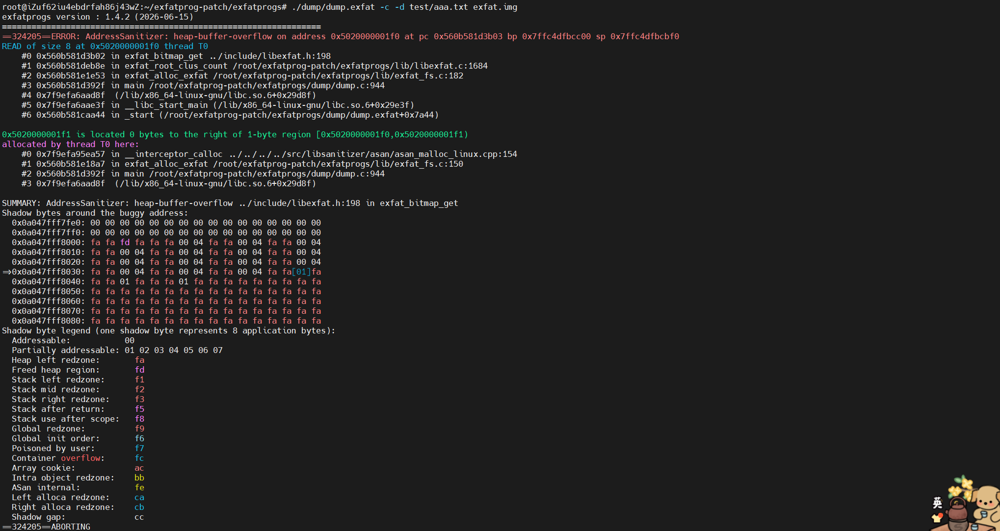

# exfat_bitmap_size_overflow镜像

## 如何构造损坏镜像

```shell
root@iZuf62iu4ebdrfah86j43wZ:~/exfatprog-patch/exfatprogs# dd if=/dev/zero of=exfat2.img bs=512 count=40960
root@iZuf62iu4ebdrfah86j43wZ:~/exfatprog-patch/exfatprogs# mkfs.exfat -c 512 exfat.img
root@iZuf62iu4ebdrfah86j43wZ:~/exfatprog-patch/exfatprogs# mkdir mnt
root@iZuf62iu4ebdrfah86j43wZ:~/exfatprog-patch/exfatprogs# mount exfat.img mnt
root@iZuf62iu4ebdrfah86j43wZ:~/exfatprog-patch/exfatprogs# cd mnt
root@iZuf62iu4ebdrfah86j43wZ:~/exfatprog-patch/exfatprogs# mkdir test
root@iZuf62iu4ebdrfah86j43wZ:~/exfatprog-patch/exfatprogs# cd test
root@iZuf62iu4ebdrfah86j43wZ:~/exfatprog-patch/exfatprogs# dd if=/dev/random of=aaa.txt bs=512 count=3
```

然后将cluster_count【偏移量0x5c】的值修改为0xffffffc1



## 如何检测出问题

开启sanitize

```
make distclean 2>/dev/null || true
./autogen.sh

CFLAGS="-O0 -g -fsanitize=address -fno-omit-frame-pointer" \
LDFLAGS="-fsanitize=address" \
./configure

make
```

执行检测：

```bash
root@iZuf62iu4ebdrfah86j43wZ:~/exfatprog-patch/exfatprogs#./dump/dump.exfat -c -d test/aaa.txt exfat.img 
```



## 修复MR

https://github.com/exfatprogs/exfatprogs/commit/3d76346ed33fcf5cdee7ea4b392f55ca0b5db22b