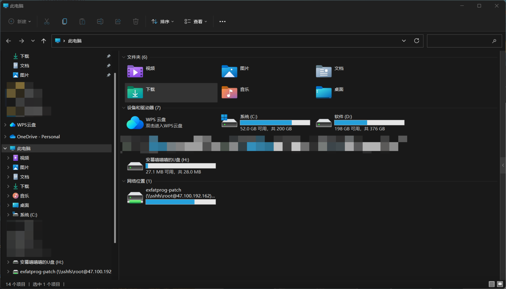
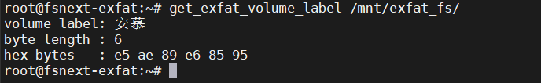
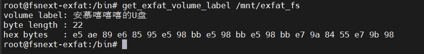

# volume_name_truncate镜像

## 如何构造测试镜像

参考[windows如何将镜像挂载成U盘](https://anmuxixixi.github.io/2026/08/10/windows%E5%A6%82%E4%BD%95%E5%B0%86%E9%95%9C%E5%83%8F%E6%8C%82%E8%BD%BD%E6%88%90U%E7%9B%98/)先制作一个有卷标的镜像出来



## 测试程序

```c
// SPDX-License-Identifier: GPL-2.0-or-later
/*
 * Read a mounted filesystem's volume label through FS_IOC_GETFSLABEL.
 *
 * Build:
 *   cc -O2 -Wall -Wextra -o get_exfat_volume_label get_exfat_volume_label.c
 *
 * Usage:
 *   sudo ./get_exfat_volume_label /mnt/exfat
 */

#include <errno.h>
#include <fcntl.h>
#include <linux/fs.h>
#include <stdio.h>
#include <string.h>
#include <sys/ioctl.h>
#include <unistd.h>

static void print_hex(const unsigned char *buf, size_t len)
{
	size_t i;

	for (i = 0; i < len; i++)
		printf("%s%02x", i ? " " : "", buf[i]);
	putchar('\n');
}

int main(int argc, char **argv)
{
	char label[FSLABEL_MAX] = { 0 };
	const char *mountpoint;
	size_t len;
	int fd;

	if (argc != 2) {
		fprintf(stderr, "Usage: %s <mount-point>\n", argv[0]);
		return 2;
	}

	mountpoint = argv[1];
	fd = open(mountpoint, O_RDONLY | O_DIRECTORY | O_CLOEXEC);
	if (fd < 0) {
		fprintf(stderr, "open(%s): %s\n", mountpoint, strerror(errno));
		return 1;
	}

	if (ioctl(fd, FS_IOC_GETFSLABEL, label) < 0) {
		int saved_errno = errno;

		close(fd);
		fprintf(stderr, "FS_IOC_GETFSLABEL(%s): %s\n",
			mountpoint, strerror(saved_errno));
		return 1;
	}

	close(fd);
	len = strnlen(label, sizeof(label));

	printf("volume label: %s\n", label);
	printf("byte length : %zu\n", len);
	printf("hex bytes   : ");
	print_hex((const unsigned char *)label, len);

	if (len == sizeof(label)) {
		fprintf(stderr,
			"warning: kernel returned a label without a NUL terminator\n");
		return 1;
	}

	return 0;
}
```

编译：

```sh
gcc -O2 -Wall -Wextra -o get_exfat_volume_label get_exfat_volume_label.c
```

放到qemu的根文件系统的bin目录下【这是我的测试步骤，对你没有任何价值，你需要自己在自己的开发环境中自己部署测试】：

>对于我的环境：
>
>```sh
># 挂载根文件系统镜像
>cd ~/fsnext-exfat
>mount -o loop rootfs.img /mnt/fsnext-root
>
># 将测试的二进制放到根目录的bin文件夹下
>cd /mnt/fsnext-root/bin
>cp get_exfat_volume_label .
>chmod 777 get_exfat_volume_label
>
># 启动qemu
>cd ~/fsnext-exfat
>./start_exfat.sh
>```
>
>进入Qemu：
>
>```sh
># 挂载测试的exfat镜像(volume_name_trun.img)
>root@fsnext-exfat:~# ./mount_exfat.sh
>```

问题复现



## 修复MR

https://git.kernel.org/pub/scm/linux/kernel/git/linkinjeon/exfat.git/commit/?h=dev&id=27af3392196ddfa4c212f4c883b9964a6dcd5f95

修复之后结果如图：



